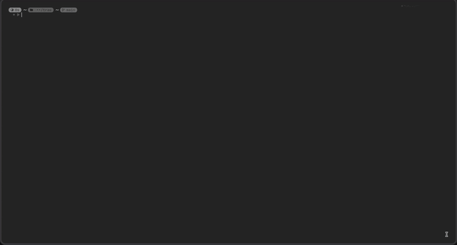

<div align="center">
  
</div>

<div align="center">


<details>
<summary>🚨 Warning </summary>
This project uses reverse engineering api z.ai, do not use it for anything because of serious/personal data, it is just a toy - not a tool 
</details>

</div>


## About
Plz Give Star


Traw is a simple and fast neuro agent that browses the internet instead of you

## Fast Start


```bash
# install the traw
git clone https://github.com/zarazaex69/traw
cd traw
bun install

# auth the traw 
bun run traw auth
 # mo server not found. install mo? [Y/n] Y 
```
<div align="center">
  
</div>

```bash
 # start the traw
bun run traw run "your goal"
```

<div align="center">

---

### Contact

Telegram: [zarazaex](https://t.me/zarazaexe)
<br>
Email: [zarazaex@tuta.io](mailto:zarazaex@tuta.io)
<br>
Site: [zarazaex.xyz](https://zarazaex.xyz)
<br>

</div>
